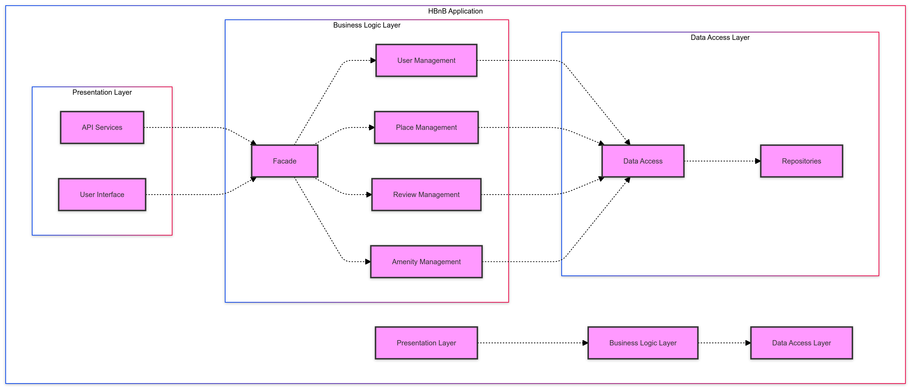

# Technical Documentation for HBnB Evolution

## 1. Introduction

### 1.1 Project Overview

HBnB Evolution is an innovative web application inspired by Airbnb, designed to facilitate property rentals and user reviews. This platform allows users to list their properties, book accommodations, and share their experiences through reviews.

### 1.2 Purpose of This Document

This technical documentation serves as a comprehensive guide for developers, architects, and stakeholders involved in the HBnB Evolution project. It outlines the system's architecture, details the business logic layer, and illustrates key API interactions.

### 1.3 Document Structure

This document is organized into four main sections:
1. High-Level Architecture: An overview of the system's layered structure.
2. Business Logic Layer: Detailed explanation of core entities and their relationships.
3. API Interaction Flows: Sequence diagrams illustrating key user interactions.
4. Conclusion: Summary of architectural decisions and their benefits.

## 2. High-Level Architecture

### 2.1 Package Diagram

### 2.2 Layer Explanations

- **Presentation Layer**: Handles user interactions and API endpoints. It's responsible for receiving requests and presenting responses to users.
- **Business Logic Layer**: Contains the core functionality and rules of the application. It processes data, applies business rules, and manages the application's entities.
- **Persistence Layer**: Manages data storage and retrieval, interfacing with the database to ensure data integrity and persistence.

### 2.3 Facade Pattern Implementation

The Facade pattern is implemented to simplify the interaction between the Presentation and Business Logic layers. It provides a unified interface to a set of interfaces in the Business Logic layer, making the system easier to use and understand.

Key benefits of using the Facade pattern in HBnB Evolution:
1. Simplified API for the Presentation Layer
2. Decoupled architecture, allowing for easier maintenance and updates
3. Centralized point for applying system-wide logic or cross-cutting concerns

## 3. Business Logic Layer

### 3.1 Class Diagram

### 3.2 Entity Descriptions

#### User Entity:
- **Role**: Represents registered users of the system.
- **Key Attributes**: id (UUID4), first_name, last_name, email, password, is_admin, created_at, updated_at
- **Main Methods**: register(), update_profile(), delete_account()
- **Relationships**: One-to-many with Place (as owner)

#### Place Entity:
- **Role**: Represents properties listed on the platform.
- **Key Attributes**: id (UUID4), title, description, price, latitude, longitude, created_at, updated_at
- **Main Methods**: create(), update(), delete(), list()
- **Relationships**: Many-to-one with User (owner), one-to-many with Review, many-to-many with Amenity

#### Review Entity:
- **Role**: Stores user reviews for places.
- **Key Attributes**: id (UUID4), rating, comment, created_at, updated_at
- **Main Methods**: create(), update(), delete()
- **Relationships**: Many-to-one with Place and User

#### Amenity Entity:
- **Role**: Represents features or services available at a place.
- **Key Attributes**: id (UUID4), name, description, created_at, updated_at
- **Main Methods**: create(), update(), delete(), list()
- **Relationships**: Many-to-many with Place

### 3.3 Entity Relationships
- User-Place: A user can own multiple places, but each place has only one owner.
- Place-Review: A place can have multiple reviews, each review is for one specific place.
- Place-Amenity: Places can have multiple amenities, and amenities can be associated with multiple places.

## 4. API Interaction Flows

### 4.1 User Registration

Step-by-step explanation:
1. User sends registration data to the API
2. API validates input data
3. Business Logic creates a new User object
4. User object is persisted in the database
5. Confirmation is sent back to the user

Key points:
- Input validation is crucial for security
- Password hashing is performed in the Business Logic layer

### 4.2 Place Creation

Step-by-step explanation:
1. Authenticated user sends place details to the API
2. API verifies user authentication and authorization
3. Business Logic creates a new Place object
4. Place object is associated with the user and persisted
5. Confirmation and place details are returned to the user

Key points:
- Only authenticated users can create places
- Geocoding might be performed to validate/standardize location data

### 4.3 Review Submission

Step-by-step explanation:
1. Authenticated user sends review data for a specific place
2. API verifies user authentication and place existence
3. Business Logic creates a new Review object
4. Review is associated with the user and place, then persisted
5. Updated place rating is calculated
6. Confirmation is sent back to the user

Key points:
- Users can only review places they've booked (business rule to be enforced)
- Place ratings are updated in real-time

### 4.4 Fetching List of Places

Step-by-step explanation:
1. User sends request for places with optional filter criteria
2. API processes the request and applies filters
3. Business Logic retrieves matching places from the database
4. Places are formatted and possibly paginated
5. List of places is returned to the user

Key points:
- Efficient database querying is crucial for performance
- Pagination is implemented to handle large datasets

## 5. Conclusion

### 5.1 Key Architectural Points
- Layered architecture promotes separation of concerns
- Facade pattern simplifies inter-layer communication
- Robust entity relationships support complex business rules

### 5.2 Benefits of the Design
1. Scalability: The layered architecture allows for easy scaling of individual components.
2. Maintainability: Clear separation of concerns makes the system easier to maintain and update.
3. Flexibility: The use of the Facade pattern allows for changes in the Business Logic layer without affecting the Presentation layer.
4. Security: Centralized authentication and authorization through the Facade enhance system security.

This architecture provides a solid foundation for the HBnB Evolution project, allowing for future growth and adaptation to changing business needs.
