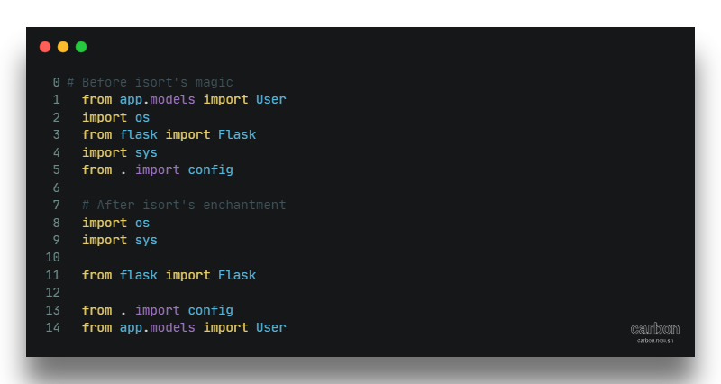
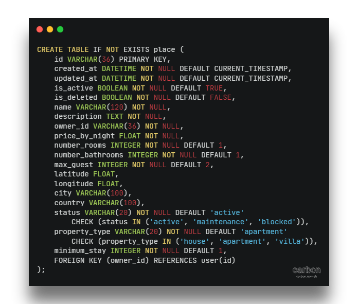
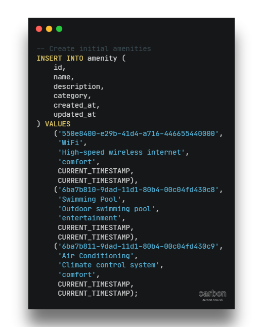

# 🏰 HBnB - The Haunted AirBnB API 👻

 

> *Welcome to the spookiest vacation rental API in the netherworld!*

## 📚 Table of Contents
- I  - [From Part2 to Part3](#from-part2-to-part3-)
- II - [Technical Choices](#technical-choices-)
    - a - [Poetry](#-poetry-the-modern-spellbook-)
    - b - [Code Quality Tools](#code-quality-guardians-)
        - [Black](#black-the-uncompromising-code-formatter-)
        - [Isort](#isort-the-import-organizer-)
        - [Flake8](#flake8-the-strict-code-guardian-️)
    - c - [Pre-commit](#pre-commit-magic-)
- III - [Implementation](#implementation-)
    - a - [Development Configuration](#development-configuration-)
    - b - [Bcrypt](#bcrypt-password-protection-)
    - c - [JWT](#jwt-authentication-)
    - d - [RBAC (Role-Based Access Control)](#rbac-role-based-access-control-)
    - e - [SQLite](#sqlite--initial-data-seeding-️)
        - [DB Schema](#our-mystical-database-schema-)
        - [DB setup & initial data](#our-mystical-database-setup-and-initial-haunted-data-)
- [Installation](#installation-)
    - a - [Prerquisites](#prerequisites-)
    - b - [Quick Start](#quick-start-)
    - c - [testing](#testing-)
    - d - [Coverage report](#coverage-report-)
- [Coming Next](#coming-next-)
- [Authors](#authors-)

## From Part2 to Part3 🔮
Our haunted journey began with a simple in-memory API in Part2. Now, in Part3, we're summoning more powerful spirits:
- SQLAlchemy for persistent data storage with SQLite 🗄️
- JWT for secure authentication 🔐
- RBAC for ghostly permissions 👑
- Swagger UI for API documentation 📖

## Technical Choices 🧙‍♀️

### Poetry: The Modern Spellbook 📦
Unlike the ancient scrolls of `pip`, Poetry brings:
- Dependency resolution that actually works (no more conflicting spells!)
- Project isolation through virtual environments
- Lock file to ensure consistent installations across haunted machines
- Simple command interface (`poetry add` vs `pip install + requirements.txt`)

### Code Quality Guardians 🧹

#### Black: The Uncompromising Code Formatter
- Enforces a consistent code style across the entire codebase
- No more debates about formatting - Black decides!
- Example transformations:

#### isort: The Import Organizer 🎯
- Automatically sorts and groups imports
- Separates standard library, third-party, and local imports
- Keeps our spellbook (code) organized and readable

#### flake8: The Strict Code Guardian 👮‍♀️
- Enforces PEP 8 style guide
- Catches potential errors and code smells
- Currently causing us some headaches with pre-commit hooks! 😅
- Won't let commits through unless code meets its high standards (or if you're in a rush you can ignore verification #I_Wont_Lie)
- Includes various plugins for additional checks:
  - `flake8-docstrings`: Ensures proper documentation
  - `flake8-import-order`: Double-checks import organization
  - `flake8-bugbear`: Catches common bugs and design problems

### Pre-commit Magic 🔮
- Runs all these tools automatically before each commit
- Currently learning to tame these powerful spells
- Sometimes requires `--no-verify` when we're in a hurry (shh, don't tell anyone! 🤫)
- Future plans include better configuration to balance strictness with practicality

It was indeed some extra work, but it was fun all the way ! you should try this at ~ (at home)

## Implementation 💫

### Development Configuration 🌙
Our magical configuration grimoire defines different environments:

- **Development**: Where we brew new spells safely 🧪
- **Testing**: Where we ensure our magic is stable 🔮
- **Production**: Where we deploy our enchantments to the real world ⚡
- Each realm has its own secrets and database connections 📚

### Bcrypt Password Protection 🔐
Password protection worthy of the most powerful protection spells:

- Using Bcrypt for one-way hashing 🔒
- Unique salt for each password 🧂
- Secure verification without ever storing plain passwords ✨
- Configurable work factor to adapt to evolving threats 🛡️

### JWT Authentication 👻
Magical tokens to identify our ghosts:

- Signed JWT tokens for secure authentication 🎭
- Custom claims to store roles and permissions 📜
- Automatic expiration for enhanced security ⏳
- Refresh tokens for seamless user experience 🔄

### RBAC (Role-Based Access Control) 👑
A permission system worthy of the grandest haunted castles:

- Three levels of permissions:
  - 👻 **Users**: Can manage their own haunted resources
  - 👑 **Admins**: Have access to all supernatural features
  - 🌍 **Public**: Limited access to public endpoints
- Magical decorators to protect our routes
- Automatic permission checking on each request
- Themed error messages to guide lost souls

### SQLite + Initial Data Seeding 🗄️

#### Our mystical Database Schema

#### Our mystical database setup and initial haunted data:

SQLite serves as our ethereal data vault:
- Lightweight yet powerful database engine 🪶
- Perfect for development and testing realms 🧪
- Single file storage for easy backup and transfer 📦
- Full SQL support for complex haunted queries ✨

Initial data seeding conjures:
- Admin ghost for system management 👑
- Basic supernatural amenities 🔮

Key features:
- Automatic database initialization on first run
- Test data for different environments
- Clean separation between dev and test data
- Easy reset and refresh capabilities

Each realm (development, testing, production) has its own data vault, ensuring our ghostly experiments don't cross paths! 👻

## Installation 🏗️

### Prerequisites 📋
Before summoning our haunted API, make sure you have these magical ingredients:
- Python 3.10+ (The most ethereal version) 🐍
- Poetry (Our mystical dependency conjurer) 📜
- SQLite (Our spectral data vault) 🗄️ (you can use sqlitebrwoser !)
- A brave soul ready to face the unknown 👻
- Some dark magic knowledge (or at least Git) 🔮

### Quick Start 🚀
Follow these mystical steps to awaken our haunted API:

Each spell in this enchanted sequence will:
- Clone our cursed repository 📚
- Enter the haunted directory 🏰
- Install magical dependencies with Poetry 🧙‍♀️
- Prepare the ghostly database 🗃️
- Summon the development server 🌟

### Testing 🧪
Ensure your spells work as intended:

Our magical test suite includes:
- Unit tests for each component 🔍
- Integration tests for API endpoints 🌐
- Authentication and authorization tests 🔐
- Database interaction tests 📊

### Coverage Report 🎯
Through countless nights of enchantments and debugging:

Our current mystical achievements:
- 76% overall coverage 📈
- Api components well tested 🎯 (core components were tested on Part2 (94% coverage !))
- Room for more magical improvements ✨
- Stable and reliable API 🏰

*Note: Some areas still need more enchantments, but we're proud of our current magical prowess!* 🧙‍♀️

## Coming Next: Part4 🎃
Stay tuned for our next spooky adventure where we'll add:
- A haunted frontend
- Real-time ghost notifications
- And more supernatural features!

## Authors 👻
Created with love and dark magic by Fassih

*Happy Haunting! 🦇*
