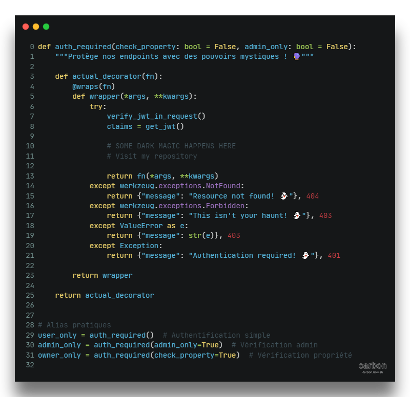
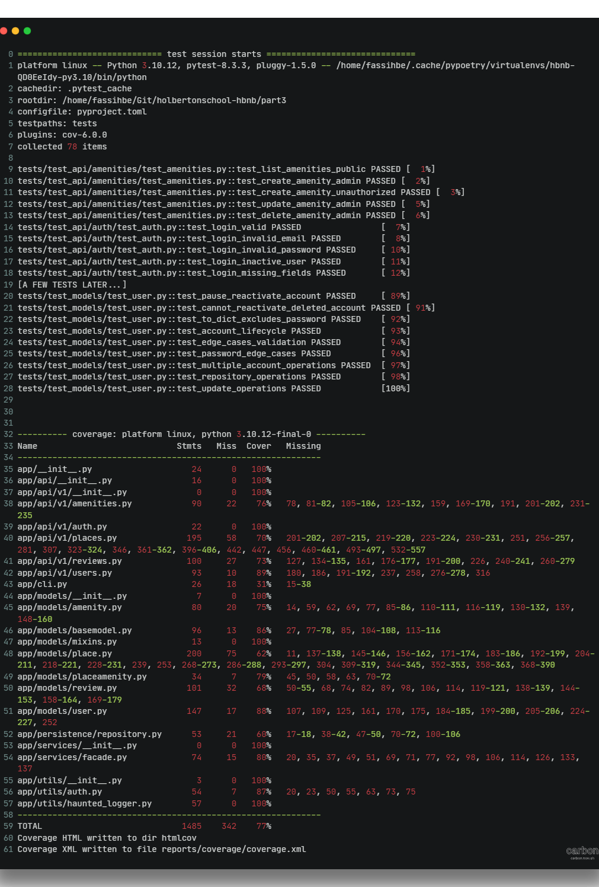

# 🏰 HBnB - The Haunted AirBnB API 👻

 

> *Welcome to the spookiest vacation rental API in the netherworld!*

## 📚 Table of Contents
- [From Part2 to Part3](#from-part2-to-part3-)
- [Technical Choices](#technical-choices)
- [Implementation](#implementation)
- [Installation](#installation)
- [Coming Next](#coming-next)
- [Authors](#authors)

## From Part2 to Part3 🔮
Our haunted journey began with a simple in-memory API in Part2. Now, in Part3, we're summoning more powerful spirits:
- SQLAlchemy for persistent data storage with SQLite 🗄️
- JWT for secure authentication 🔐
- RBAC for ghostly permissions 👑
- Swagger UI for API documentation 📖

## 🧙‍♀️ Technical Choices
We've brewed a powerful potion using:
- **Poetry**: For magical dependency management
- **Pre-commit hooks**: Our quality guardians (still learning their mysterious ways!)
  - Black: The code formatter that brings order to chaos
  - isort: Keeps our imports as neat as a vampire's cape
  - flake8: Our strict but fair code quality enforcer

## 💫 Implementation

### 🌙 Development Configuration

### 🔐 Bcrypt Password Protection

### 👻 JWT Authentication

### 👑 RBAC (Role-Based Access Control)

## 🏗️ Installation

### 📋 Prerequisites
- Python 3.10+
- PostgreSQL
- A brave soul

### 🚀 Quick Start

### 🧪 Testing

There is still room for improvment, still i am proud to announce a 76% coverage for the App :

## 🎃 Coming Next: Part4
Stay tuned for our next spooky adventure where we'll add:
- A haunted frontend
- Real-time ghost notifications
- And more supernatural features!

## 👻 Authors
Created with love and dark magic by [Your Names]

*Happy Haunting! 🦇*
