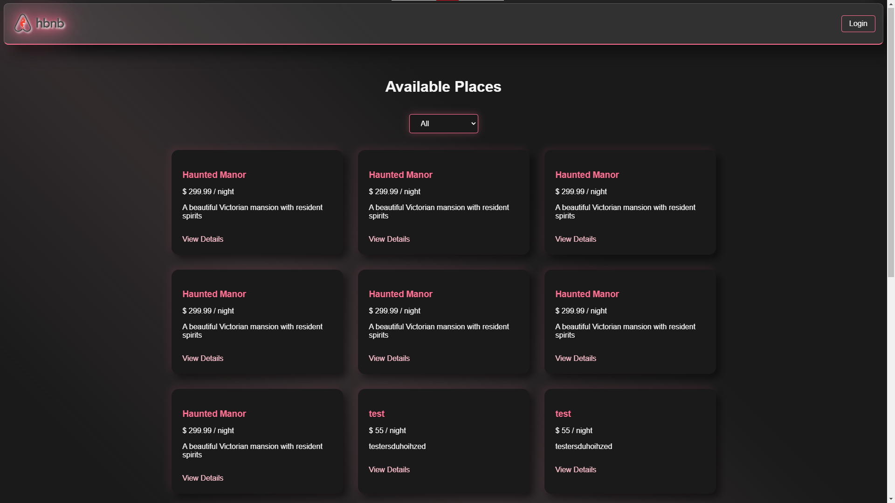
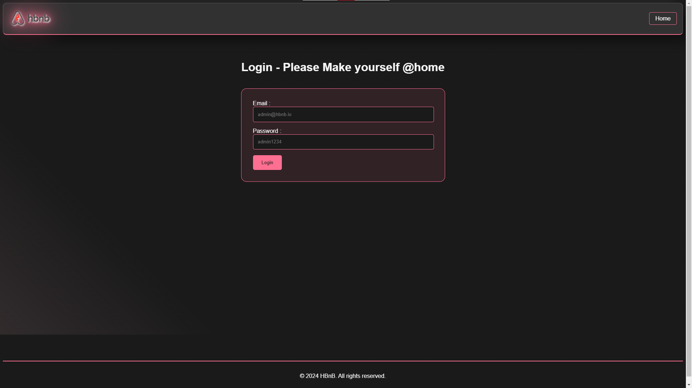
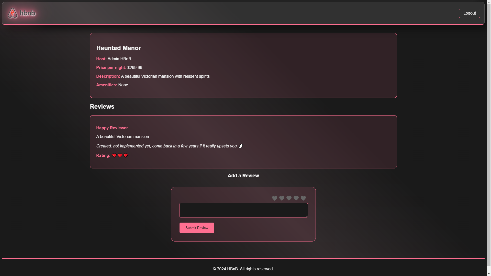
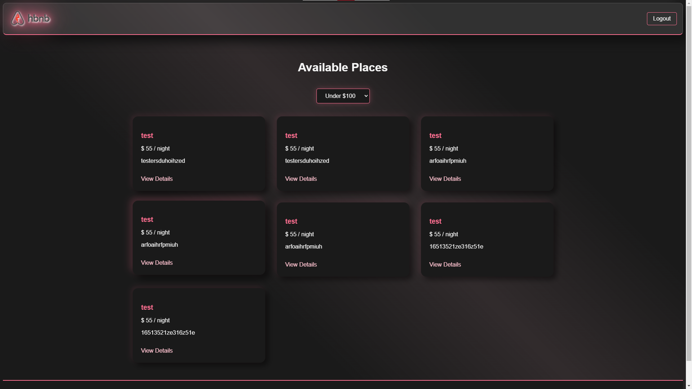

# HBnB - Haunted BnB 👻

A spooky twist on accommodation booking, featuring a dark theme with elegant pink accents.

## Features ✨

- **Dark Theme**: Sleek dark interface with neon pink highlights
- **Responsive Design**: Beautiful on all devices
- **Dynamic Filtering**: Filter places by price range
- **Smooth Animations**: Subtle transitions and hover effects
- **Authentication**: Secure login system
- **Review System**: Rate and review places with cute pink hearts

## Tech Stack 🛠️

- HTML5
- CSS3
- Vanilla JavaScript
- Flask Backend API
- SQLAlchemy Database

## Design Highlights 🎨

- Neumorphic cards with pink shadow effects
- Glassmorphism elements
- Animated gradient backgrounds
- Custom styled form elements
- Interactive hover effects

## Getting Started 🚀

1. Clone the repository
2. Start the backend server (see backend documentation)
3. Open `index.html` in your browser
4. Get spooked! 👻

```bash
# 1 Clone this repo
git clone https://www.github.com/Noziop/holbertonschool-hbnb.git

# 2 Start BOTH back&front servers from a fingersnap :
cd holbertonschool-hbnb
gnome-terminal -- ./start.sh

# 3 open part4/index.html in your system's default web browser :
xdg-open part4/index.html
```

## Screenshots 📸

- Homepage



- Login interface with glassmorphic effect



- Place details with review system



- Price filter functionality




## Contributors 👥

- Frontend Development & Design: [Noziop](https://www.github.com/Noziop)
- Backend API: [Noziop](https://www.github.com/Noziop)

## License 📝

This project is licensed under the MIT License